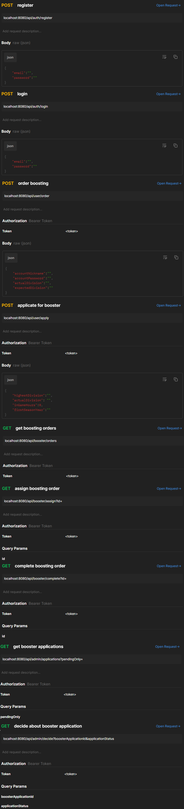

# 7capa7 Rest Api with Spring Boot
* League of legends boosting service. there are several types of users. Anyone can create an account and log in. The user can order boosting and apply for the role of a booster. A booster, apart from ordering boosting, can also take boosting orders from others, check available orders, and set his own orders as ready. Admin, apart from all those things that admin and user can check and accept or reject booster applications submitted by users.

## Requirements
* Java 17+, Spring Boot 3.0+, Spring Framework 6.0+, Docker, Make, Maven

## Quick Start
* To compile project: Make build-all-local
* To run application: Make start-dev-env
* To close application: Make stop-dev-env
* Application by default starts on localhost : 8080
* At the start of the app will be created test users: "user@user.pl", "booster@booster.pl", "admin@admin.pl" all with password "password"

